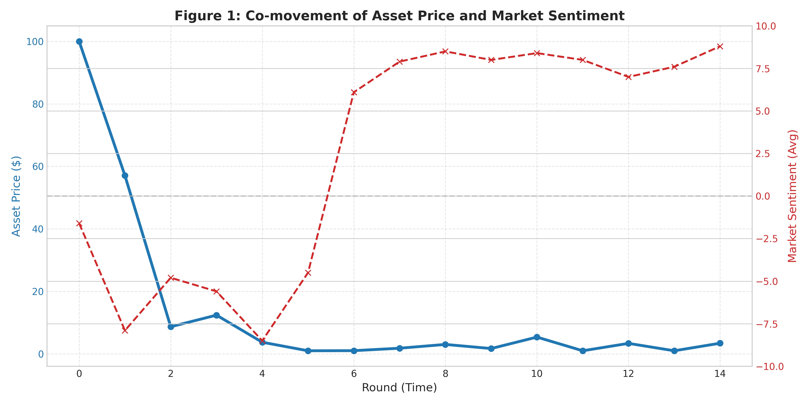
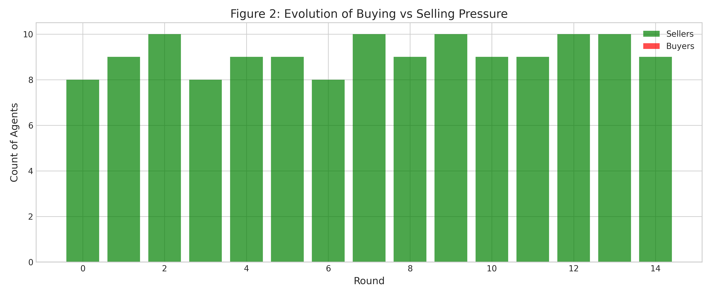

# 📊 Whispers in the Order Book: LLM-Driven Market Simulation

[](https://opensource.org/licenses/MIT)
[](https://www.python.org/downloads/)

> **A Generative Agent-Based Model (G-ABM) for Simulating Narrative-Driven Financial Market Dynamics**

This repository contains the implementation of the research paper *"Whispers in the Order Book: Simulating Asset Bubbles via LLM-Driven Narrative Propagation"*. We use **Large Language Models (LLMs)** as cognitive engines to simulate how psychological biases and narrative distortions propagate through social networks, leading to phenomena like flash crashes, bubbles, and post-truth markets.

And also, its a part of my final project for the course **SEC352: An Introduction to FinTech** taught by Wanwan Liang(And if Ms Liang has seen this, hello!) at **University of International Business and Economics**.
---

## 🎯 Research Overview

Traditional Agent-Based Models (ABMs) rely on hard-coded heuristics. We replace them with **LLM-powered agents** that:
- **Think**: Process market information through the lens of Prospect Theory and Loss Aversion
- **Gossip**: Mutate and spread narratives via random gossip protocols
- **Trade**: Execute orders in a simulated limit order book (LOB) environment

### Key Contributions
1. **Narrative Mutation Mechanism**: Formalizes how rumors evolve through social transmission
2. **Endogenous Price Formation**: Liquidity-adjusted price impact model based on order flow
3. **Five Controlled Experiments**: Isolating the effects of ambiguity, FOMO, policy uncertainty, and misinformation backfire

---

## 🏗️ System Architecture

```
┌─────────────────────────────────────────────────────────────┐
│                     Gemini 2.5 Flash API                    │
│                  (Cognitive Decision Engine)                 │
└────────────────────┬────────────────────────────────────────┘
                     │
         ┌───────────▼──────────┐
         │   FinancialAgent     │
         │  - System Prompt     │◄──── Psychological Profiles
         │  - Portfolio State   │      (Rational / FOMO / Paranoid)
         │  - Inbox (Rumors)    │
         └───────────┬──────────┘
                     │
         ┌───────────▼──────────┐
         │  Gossip Protocol      │◄──── Random Network (k=2)
         │  (Narrative Mutation) │
         └───────────┬──────────┘
                     │
         ┌───────────▼──────────┐
         │   Market Simulator    │
         │  - Order Flow (NOI)   │
         │  - Price Impact       │◄──── Liquidity Decay Model
         │  - Event Injection    │
         └───────────────────────┘
```

---

## 📦 Installation

### Prerequisites
- Python 3.12+
- Google Gemini API Key ([Get one here](https://aistudio.google.com/apikey))

### Setup

```bash
# 1. Clone the repository
git clone https://github.com/MochiaoChen/G-ABM.git
cd G-ABM

# 2. Create virtual environment
python -m venv .venv
source .venv/bin/activate  # On Windows: .venv\Scripts\activate

# 3. Install dependencies
pip install -r requirements.txt

# 4. Configure API Key
echo "GEMINI_API_KEY=your_api_key_here" > .env
```

---

## 🚀 Usage

### Running Experiments

All experiments are defined as YAML configuration files in [`configs/`](configs/):

```bash
# S1: Control (Rational Baseline)
python src/main.py --config configs/s1_control.yaml

# S2: Ambiguity-Induced Flash Crash
python src/main.py --config configs/s2_ambiguity.yaml

# S3: FOMO-Driven Bubble
python src/main.py --config configs/s3_fomo_bubble.yaml

# S4: Policy Uncertainty (Fog of War)
python src/main.py --config configs/s4_policy_fog.yaml

# S5: Failed Debunking (Backfire Effect)
python src/main.py --config configs/s5_failed_correction.yaml
```

### Output Structure

Each simulation generates:
- **CSV Log**: `outputs/<scenario_name>_<timestamp>.csv`
  - Columns: `Round`, `Agent`, `Price`, `Sentiment`, `Action`, `Rumor`
- **Console Output**: Real-time trading actions and narrative mutations

---

## 📁 Project Structure

```
G-ABM/
├── configs/              # Experiment configurations (YAML)
│   ├── s1_control.yaml
│   ├── s2_ambiguity.yaml
│   ├── s3_fomo_bubble.yaml
│   ├── s4_policy_fog.yaml
│   └── s5_failed_correction.yaml
├── src/
│   ├── main.py           # Simulation orchestrator
│   ├── agent.py          # LLM-powered agent logic
│   ├── llm.py            # Gemini API client
│   └── ...
├── notebook/
│   └── nb01_plot.ipynb   # Visualization & statistical analysis
├── outputs/              # Simulation logs (CSV)
├── .env                  # API credentials (not tracked)
├── requirements.txt
└── README.md
```

---

## 🧪 Experimental Design

| Scenario | Description | Key Mechanism |
|----------|-------------|---------------|
| **S1** | Rational Baseline | Efficient Market Hypothesis (EMH) |
| **S2** | Ambiguity → Panic | Loss Aversion + Narrative Catastrophization |
| **S3** | Positive Hype → Bubble | FOMO + Pyramiding Behavior |
| **S4** | Policy Fog of War | Herd Mentality + Confusion Amplification |
| **S5** | Failed Debunking | Confirmation Bias + Conspiracy Mutation |

**Controlled Variables**:
- Agent Count: 50
- Simulation Rounds: 15
- LLM Temperature: 1.1
- Gossip Branching Factor: 2

---

## 📊 Sample Results

### S2: Flash Crash Visualization


*Market collapses as ambiguous rumor mutates into panic-inducing narrative.*

### S5: Backfire Effect


*Official debunking intensifies selling pressure (conspiracy theorists dominate).*

---

## 🔬 Reproducing the Paper

To replicate the exact results from the paper:

```bash
# Run all 5 scenarios sequentially
for config in configs/*.yaml; do
    python src/main.py --config $config
done

# Analyze results
jupyter notebook notebook/nb01_plot.ipynb
```

**Note**: Due to LLM non-determinism, exact numerical values may vary slightly. Statistical trends remain consistent.

---

## 🛠️ Key Components

### 1. Agent Cognitive Model ([`src/agent.py`](src/agent.py))

```python
class FinancialAgent:
    def act(self, current_price):
        unrealized_pnl = (self.shares * current_price) - self.cost_basis
        
        decision = self.llm.generate_decision(
            system_prompt=self.system_prompt,
            context=f"Price: ${current_price}, PnL: ${unrealized_pnl}"
        )
        
        # 3. Execute trade & mutate rumor
        return decision
```

### 2. Price Impact Model ([`src/main.py`](src/main.py#L45))

$$
r_t = \ln(P_{t+1}) - \ln(P_t) = \frac{1}{\mathcal{L}_t} \cdot (V_{\text{buy},t} - V_{\text{sell},t}) + \xi_t
$$

Where liquidity decays exponentially:
$$
\mathcal{L}_t = \mathcal{L}_0 \cdot e^{-\lambda \cdot \text{vol}_t}
$$

---

## 📚 Citation

If you use this code in your research, please cite:

```bibtex
@article{chen2025whispers,
  title={Whispers in the Order Book: Simulating Asset Bubbles via LLM-Driven Narrative Propagation},
  author={Chen, Mochiao},
  journal={to be shown after I have finished the paper},
  year={2025}
}
```

---

## 🤝 Contributing

Contributions are welcome! Please:
1. Fork the repository
2. Create a feature branch (`git checkout -b feature/amazing-idea`)
3. Commit your changes (`git commit -m 'Add amazing feature'`)
4. Push to the branch (`git push origin feature/amazing-idea`)
5. Open a Pull Request

---

## 📄 License

This project is licensed under the MIT License - see the [LICENSE](LICENSE) file for details.

---

## 🙏 Acknowledgments

- **Google Gemini Team** for the powerful LLM
- **Google Developers Group** for sponser me with free API quota
- **Robert Shiller** for pioneering work on narrative economics

---

## 📧 Contact

**Mochiao Chen**  
📧 Email: [mochiaochen@gmail.com]  
🐦 Twitter: [@MochiaoChen]  
GitHub: [github.com/MochiaoChen](but you have arrived there LOL)
---

<p align="center">
  <i>Built with ❤️ for finance and technology</i>
</p>